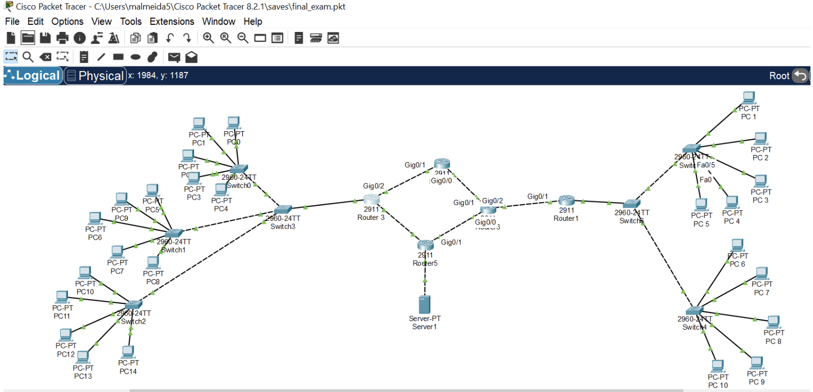

# EIGRP-VLAN-Network-Project
---

## 📖 Project Overview  
This project demonstrates the design, configuration, and testing of a **multi-site enterprise network** that connects two geographical regions (Florida and California). The lab simulates real-world enterprise networking by combining **dynamic routing (EIGRP)**, **VLAN segmentation**, and **router-on-a-stick inter-VLAN routing** to achieve secure and efficient connectivity.  

The primary goal was to:  
- Configure a **multi-router topology** with full route propagation.  
- Segment the California site into **Sales, Finance, and IT VLANs**.  
- Ensure **end-to-end connectivity** between all PCs and a central server.  
- Validate network performance with routing tables, ping, and traceroute tests.  

---

## 🗂 Network Topology  

Below is the multi-router, multi-site topology connecting Florida and California using EIGRP and VLAN segmentation:  

The network consists of **five routers, multiple switches, and PCs** across two regions:  

- **Florida Site (Router1)**  
  - Connects directly to the Florida LAN.  
- **Intermediary Router (Router6)**  
  - Serves as a hub, linking Router1 (Florida) with Router4 and Router5.  
- **California Site (Router0 / Router3)**  
  - Acts as the California gateway.  
  - Provides **router-on-a-stick VLAN routing** for Sales, Finance, and IT.  
- **Router5**  
  - Connects to Router0 and hosts a **server** accessible across the enterprise.  
- **Switches (California)**  
  - VLAN 10 → Sales  
  - VLAN 20 → Finance  
  - VLAN 30 → IT  

> *(Tip: add a `topology.png` diagram of your Packet Tracer/GNS3 network here for a visual.)*  

---

## 🔑 IP Addressing Scheme  

### Florida LAN  
- Subnet: `192.168.2.0/28`  
- Default Gateway: `192.168.2.1` (Router1)  

### California VLANs  
- VLAN 10 (Sales): `192.168.1.0/27` → Gateway: `192.168.1.1`  
- VLAN 20 (Finance): `192.168.1.32/27` → Gateway: `192.168.1.33`  
- VLAN 30 (IT): `192.168.1.64/27` → Gateway: `192.168.1.65`  

### Server  
- IP: `192.168.1.122/29`  
- Default Gateway: `192.168.1.121`  

### Router Links  
- Point-to-point links configured with `/30` subnets for efficient IP use.  

---

## ⚙️ Device Configurations  

- **Routers (R1, R6, R4, R5, R0):**  
  - Configured with **EIGRP** to dynamically propagate routes.  
  - IP addressing applied per design.  

- **Switches (California):**  
  - Configured with **VLANs** for Sales, Finance, and IT.  
  - Trunk ports used for inter-VLAN routing via Router0.  

- **Server:**  
  - Configured with static IP and default gateway.  

*(Optional: include sample config snippets in a `configs/` folder for Router1, Router6, etc.)*  

---

## ✅ Testing & Validation  

- **Ping Tests:**  
  - Confirmed communication between Florida PCs ↔ California VLAN PCs.  
  - Verified server connectivity from all VLANs and the Florida LAN.  

- **Traceroute:**  
  - Showed correct hop-by-hop routing across intermediary routers.  

- **Routing Tables:**  
  - `show ip route` confirmed EIGRP route propagation.  

- **EIGRP Neighbor Status:**  
  - `show ip eigrp neighbors` confirmed stable adjacencies.  

✅ **Result:** End-to-end connectivity across the enterprise with stable routing and correct VLAN segmentation.  

---

## 📌 Key Learnings  

- How to design and implement a **multi-site enterprise network**.  
- Application of **EIGRP** for dynamic routing across multiple routers.  
- VLAN segmentation and **router-on-a-stick** inter-VLAN routing.  
- Verification using ping, traceroute, and Cisco show commands.  
- Hands-on practice with **subnetting, routing, and switching** in enterprise environments.  

---

## 📂 Repository Contents  

- `Networking_Lab_Report.pdf` → Full project documentation.  
- `configs/` (optional) → Router & switch configuration files.  
- `topology.png` (optional) → Network diagram.  
- `README.md` → Project description and summary.  

---

## 🏷️ Keywords  
`Networking` · `Cisco` · `Routers` · `EIGRP` · `VLAN` · `Subnetting` · `Enterprise Networks`  
